## DIU - Practica2, entregables

Descripción Breve de la App

Aplicación para AR que permite ver las calles de Granada mediante una recreación en 3D de su supuesto aspecto durante la época nazarí en sus diferentes califatos y con la opción de seleccionar el nivel de profundidad de las explicaciones y descripciones. Incluirá las diferentes rutas que seguían los ciudadanos de la época y conforme vas caminando se podrá visualizar toda la arquitectura y creatividades de la cultura nazarí.
### Ideación 
* Point of View 

| User            | Need          | Insight    |
| :-------------: |:-------------:| :-----:    |
| Persona turista en Granada que tiene un especial interés por la cultura arabe.     |Indagar más en el mundo arabe de Granada, la historia de la ciudad relacionada con la cultura arabe. | El usuario no desea contratar una visita guiada ya que supone una restricción de tiempo (horario y duración marcadas). Preferiría poder realizar la visita a su propio ritmo.     |
| Persona que estudia la cultura arabe.     | Explorar cómo era el mundo arabe en la ciudad de Granada.       |   El usuario tiene un conocimiento avanzado de la cultura arabe y es difícil encontrar un guía a la altura de su conocimiento por ello prefiere poder visualizar cómo era la ciudad.    |
| Persona estudiante o profesor de Arquitectura /Bellas Artes/Historia del arte en Granada que quiere disponer de una perspectiva visual de cómo ha sido Granada a lo largo de la historia. | Poder explicar y enseñar cómo hacían las diferentes estructuras, obras de arte y creatividades en la cultura nazarí.     |   Estos usuarios podrían recurrir a explicaciones clásicas en las que el profesor describe la escenografía, pero preferirían disponer de algún otro método más visual que pueda favorecer la comprensión y adquisición de los conocimientos. Los profesores pueden además estar incentivados a usar las nuevas tecnologías por parte de los centros en los que trabajan     |
| Persona extranjera y/o con dificultades de oído o de comprensión | Poder realizar una visita guiada a su propio ritmo sin depender de otras personas | Estos usuarios pueden encontrar dificultades al realizar una visita guiada convencional, bien porque no disponen de guías en su idioma o porque su discapacidad no les permite comprender todo completamente y les da vergüenza interrumpir la dinámica de grupo para requerir una segunda explicación. Preferirían poder disponer de una forma de realizar la visita a su propio ritmo |

### PROPUESTA DE VALOR
* ScopeCanvas

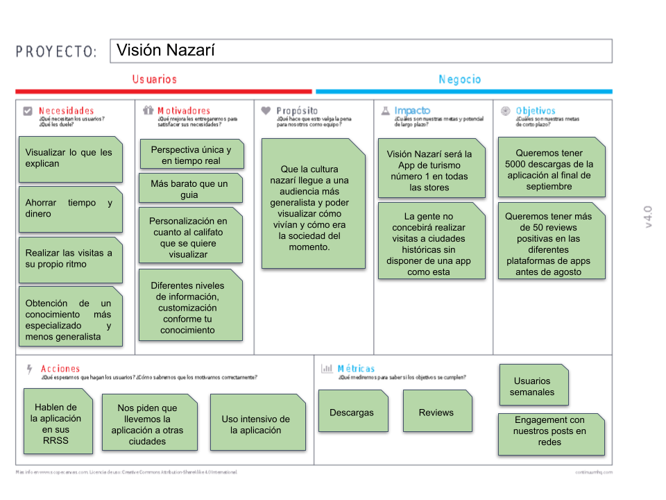

### TASK ANALYSIS

* User/Task flow

El diagrama muestra la interacción con la aplicación de un usuario que entra a la aplicación por primera vez. Lo primero que hace es ir a ver el menú de opciones, donde en las preguntas frecuentes se informa acerca del uso que realiza la aplicación de su localización. Después quiere probar la opción de ruta personalizada, con lo que puede experimentar la realidad aumentada de los monumentos de la ciudad. Después se interesa por el menú de lugares emblemáticos, en el que por proximidad la aplicación le recomienda el patio de los leones. No obstante, su visita a la Alhambra no es hasta mañana, por lo que retrocede y decide probar finalmente una de las rutas por la ciudad ofrecida por la aplicación. Durante su prueba de la aplicación, ha desbloqueado varias insignias por haber usado las funcionalidades proporcionadas por lo que por último decide comprobar la pestaña de emblemas, en la cuál puede visualizar sus logros desbloqueados.

 
### ARQUITECTURA DE INFORMACIÓN

* Sitemap 

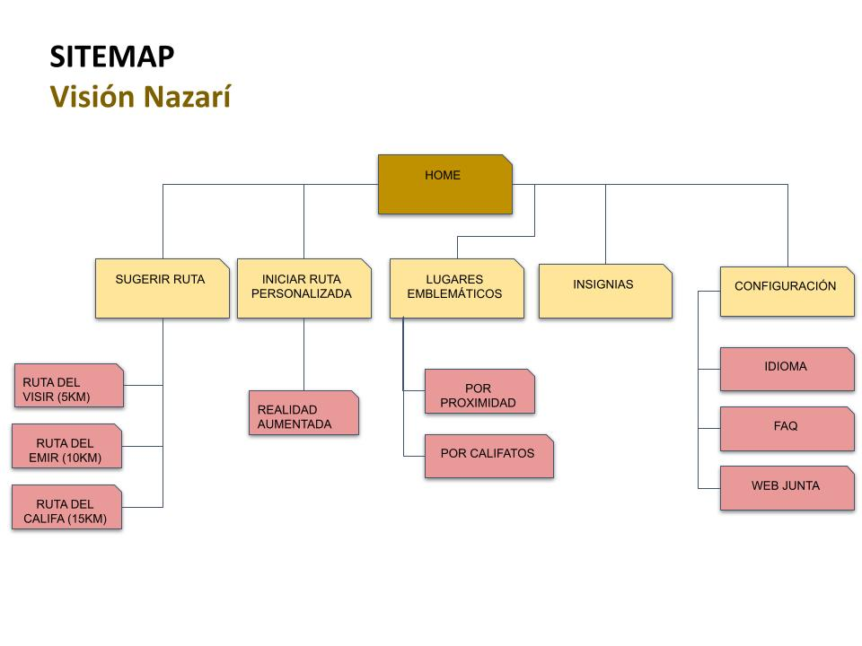 

* Labelling 

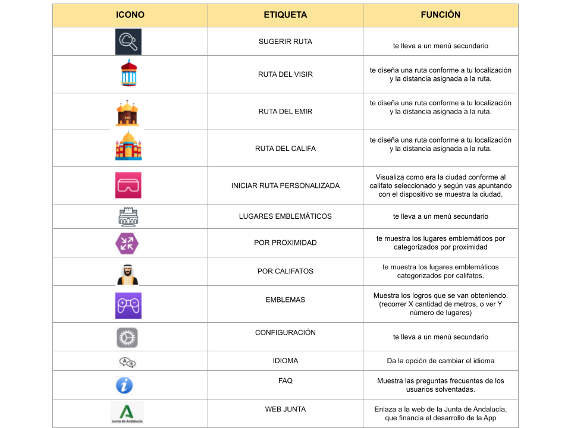 

### Prototipo Lo-FI Wireframe 

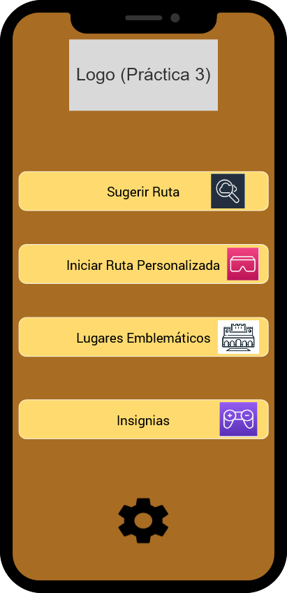 

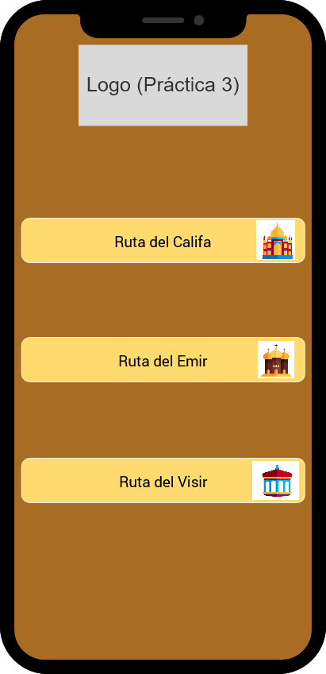

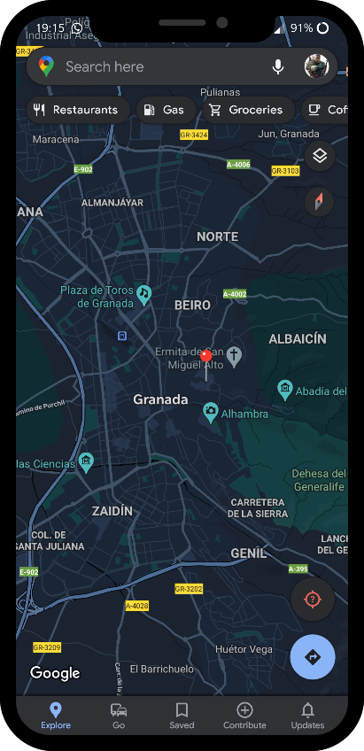 

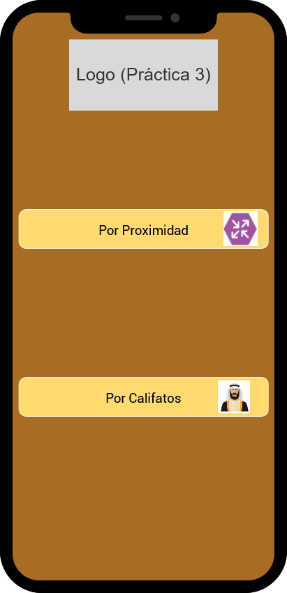 

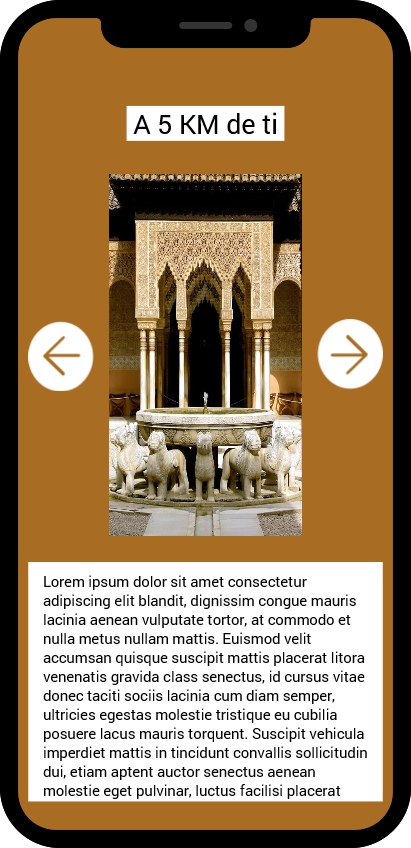 

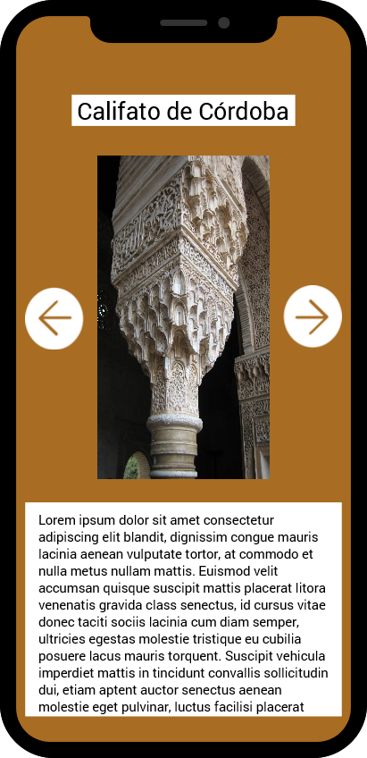 

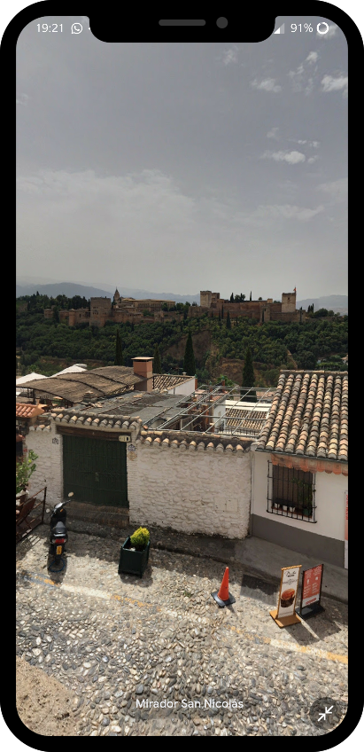 

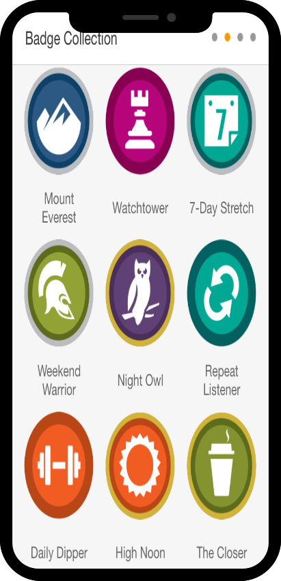 

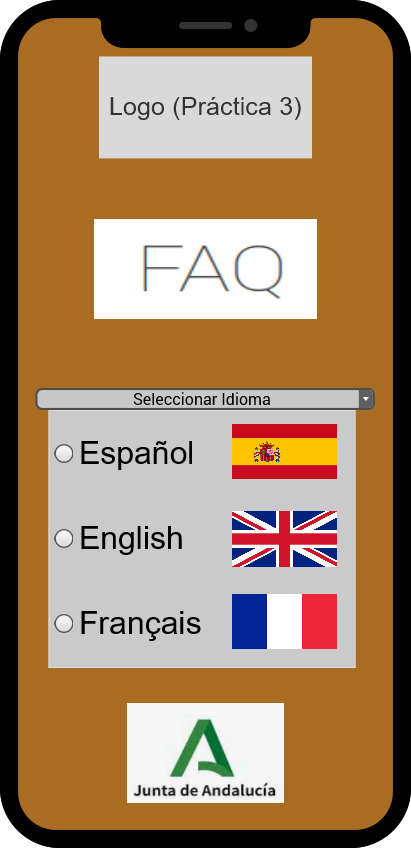

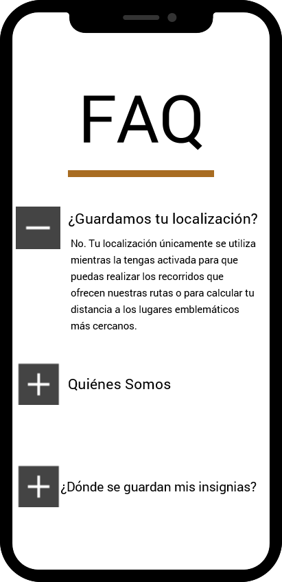
### Conclusiones  

En nuestra opinión, hemos comprobado que a la hora de realizar el prototipo hemos tenido que tener muy en cuenta nuestros buyer persona, ya que no todos los usuarios saben utilizar ciertas aplicaciones moviles. Por otro lado para realizar el scope canvas hemos analizado como está el mercado en cuanto a aplicaciones institucionales que cubran las necesidades que hemos descubierto en nuestro user target. Hemos visto muy interesante el hecho de utilizar herramientas de prototipado, ya que las vemos muy utiles para otras asignaturas incluso para proyectos propios.
