# DIU21
Prácticas Diseño Interfaces de Usuario 2020-21 (Tema: Turismo) 

Grupo: DIU2.TheThruster  Curso: 2020/21 
Updated: 8/2/2021

Proyecto: 
Visión Nazarí

Descripción: 

Aplicación AR que permite ver las calles de Granada mediante una recreación en 3D de su supuesto aspecto durante la época nazarí en sus diferentes califatos y con la opción de seleccionar el nivel de profundidad de las explicaciones y descripciones. Incluirá las diferentes rutas que seguían los ciudadanos de la época y conforme vas caminando se podrá visualizar toda la arquitectura y creatividades de la cultura nazarí.

Logotipo:  
  
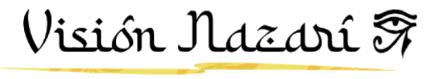

Miembros
 * :bust_in_silhouette:  Escalona García, Alejandro     :octocat:    [@AlejandroEscalona](https://github.com/AlejandroEscalona)
 * :bust_in_silhouette:  Fernández Alcaide, Alejandro     :octocat:  [@AlejandroFrndz](https://github.com/AlejandroFrndz)

----- 

# Proceso de Diseño 

## Paso 1. UX Desk Research & Analisis 

 1.a Competitive Analysis
-----

>>> Describe brevemente características de las aplicaciones que tienes asignadas, y por qué has elegido una de ellas (150-300 caracteres) 
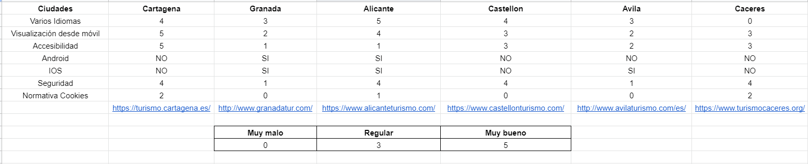

Las categorías contempladas en el análisis, que creemos relevantes para webs de estas características son:

Visualización desde el móvil → Puesto que muchas personas actualmente usan su dispositivo móvil para prácticamente todo, consideramos relevante que las webs presenten un diseño suficientemente responsive que permite una navegación cómoda con un teléfono.

Android/IOS → Se considera la existencia, o no, de una aplicación web para turismo de la ciudad que haya sido desarrollada para el ayuntamiento u otra entidad pública relacionada con la ciudad

Seguridad → Se contemplan aspectos quizás más técnicos (uso de https, mantenimiento de los certificados) pero de las que un navegador puede avisar a usuarios que, sin tener conocimiento técnico, pueden evitar el uso de la web (aviso de seguridad)

Normativa de cookies → De acuerdo con la normativa vigente, se evalúa tanto que se avise del uso de cookies como que se permita la configuración de las cookies de terceros

 1.b Persona
-----

>>> Comenta brevemente porqué has seleccionado a esas personas y sube una captura de pantalla de su ficha  (80-150 caracteres)

En primer lugar hemos seleccionado a Elena, es una persona con pocas capacidades tecnologicas y poca experiencia con ellas, es reacia a su uso pero sabe que son muy necesarias. Le gusta mucho viajar y nos puede mostrar los problemas que los desarrolladores de la web no podríamos ver al ver su uso muy fácil.

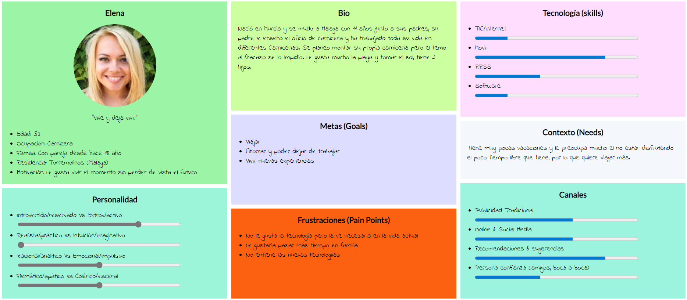

En segundo lugar, hemos creado a Shay. La característica más relevante de Shay es que es una persona con dificultades de visión (dislexia) y que además es de otro país y no habla español. Gracias a esto podremos comprobar como de preparadas están las webs, tanto en contenido como en interfaz de usuario, para poder ser empleadas por personas con dificultades similares.

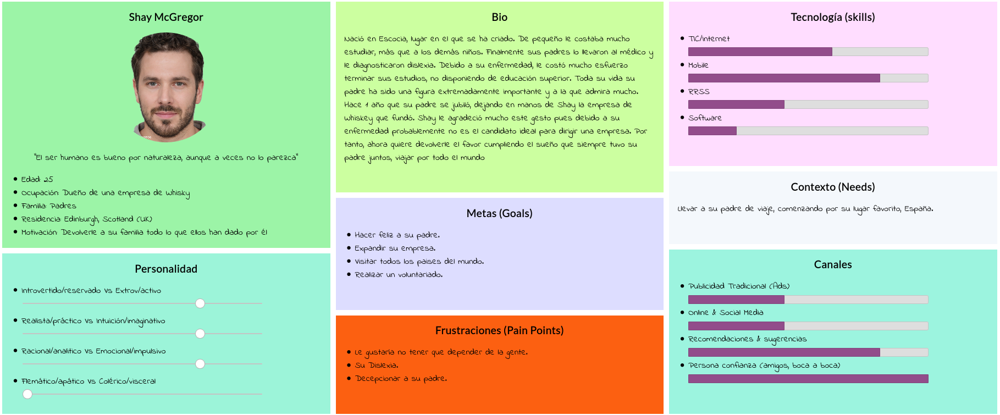

 1.c User Journey Map
----
--------- Elena ---------------

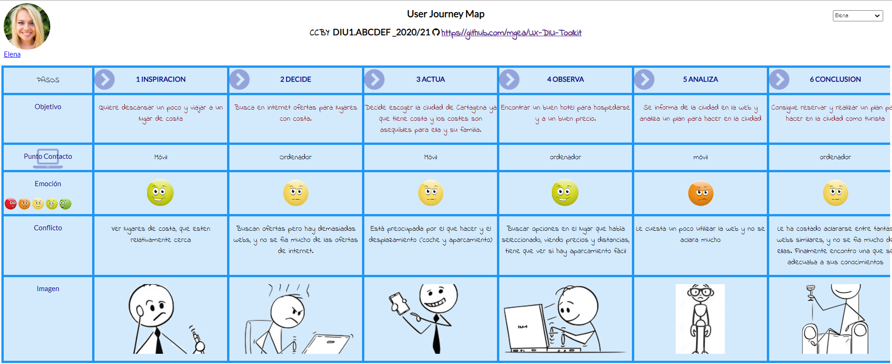

En el mapa de Elena podemos ver, que la gran dificultad ha sido en encontrar la web adecuada, y un poco el uso. Aunque la web tiene muy trabajada la accesibilidad, la usabilidad no tanto. Por otro lado puede encontrar información util como aparcamientos y planes para hacer.

-------- Shay -------

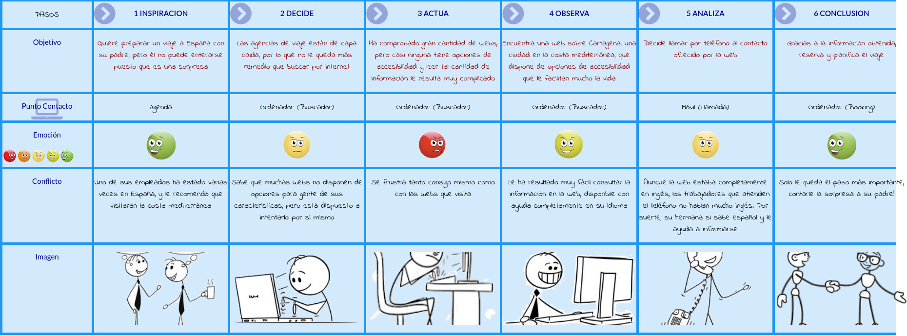

Con shay podemos ver una interacción poco común. A pesar de ser una persona joven, práticamente nativa digital que maneja sin problema la tecnología, su enfermeda hace que tenga otro tipo de dificultades y limitaciones que a menudo no son tenidas en cuenta en muchos productos/servicios/interfaces

>>> Comenta brevemente porqué has escogido estas dos experiencias de usuario (y si consideras que son habituales) (80-150 caracteres) 

 1.d Usability Review
----
>>>  Revisión de usabilidad: (toma los siguientes documentos de referncia y verifica puntos de verificación de  usabilidad
>>>> SE deben incluir claramente los siguientes elementos
>>> - Enlace al documento:  
>>> - Valoración final (numérica): 77
>>> - Comentario sobre la valoración: En términos generales la web tiene buena usabilidad, y a pesar de que nuestros usuarios creados tienen diferentes tipos de dificultades han podido navegar y usar la web con relativa facilidad. En el caso de Shay el gran desarrollo de la accesibilidad de la web ha provocado que pueda usarla con facilidad. Y en cuanto a Elena el que la web sea muy legible y clara le ha permitido avanzar hacia sus objetivos. Por concluir, comentar que la web ha sacado un 77/100 en el análisis de usabilidad por lo que consideramos que tiene buena nota pero tiene ciertos aspectos a mejorar.

## Paso 2. UX Design  

 2.a Feedback Capture Grid / Empathy map / POV
----
Hemos elegido hacer un POV
| User            | Need          | Insight    |
| :-------------: |:-------------:| :-----:    |
| Persona turista en Granada que tiene un especial interés por la cultura arabe.     |Indagar más en el mundo arabe de Granada, la historia de la ciudad relacionada con la cultura arabe. | El usuario no desea contratar una visita guiada ya que supone una restricción de tiempo (horario y duración marcadas). Preferiría poder realizar la visita a su propio ritmo.     |
| Persona que estudia la cultura arabe.     | Explorar cómo era el mundo arabe en la ciudad de Granada.       |   El usuario tiene un conocimiento avanzado de la cultura arabe y es difícil encontrar un guía a la altura de su conocimiento por ello prefiere poder visualizar cómo era la ciudad.    |
| Persona estudiante o profesor de Arquitectura /Bellas Artes/Historia del arte en Granada que quiere disponer de una perspectiva visual de cómo ha sido Granada a lo largo de la historia. | Poder explicar y enseñar cómo hacían las diferentes estructuras, obras de arte y creatividades en la cultura nazarí.     |   Estos usuarios podrían recurrir a explicaciones clásicas en las que el profesor describe la escenografía, pero preferirían disponer de algún otro método más visual que pueda favorecer la comprensión y adquisición de los conocimientos. Los profesores pueden además estar incentivados a usar las nuevas tecnologías por parte de los centros en los que trabajan     |
| Persona extranjera y/o con dificultades de oído o de comprensión | Poder realizar una visita guiada a su propio ritmo sin depender de otras personas | Estos usuarios pueden encontrar dificultades al realizar una visita guiada convencional, bien porque no disponen de guías en su idioma o porque su discapacidad no les permite comprender todo completamente y les da vergüenza interrumpir la dinámica de grupo para requerir una segunda explicación. Preferirían poder disponer de una forma de realizar la visita a su propio ritmo |

 2.b ScopeCanvas
----

 2.b Tasks analysis
-----

 

 2.c IA: Sitemap + Labelling 
----
* Sitemap 
 
* Labelling 
 

 2.d Wireframes
-----

Para ver las imágenes con todos los prototipos [pulse aquí](https://github.com/AlejandroFrndz/DIU/tree/master/P2)

## Paso 3. Mi UX-Case Study (diseño)

 3.a Moodboard
-----
Logotipo:

Para su creación, hemos empleado la herramienta online https://www.photopea.com/ La resolución empleada para la imagen aquí introducida es de 512x80, pero si fuese necesario podría generarse a diferentes resoluciones. La imagen empelada podría perfectamente usarse como cabecera de Twitter o algún otro uso similar pues está dispuesta en horizontal. No obstante, para por ejemplo una campaña en Instagram (stories por ejemplo) se requerirñia generar una imagen con un layout en vertical para adecuarla mejor al formato de la app.

A continuación se recogen varios mockups que muestran como quedaría el logo usado en diferentes productos:

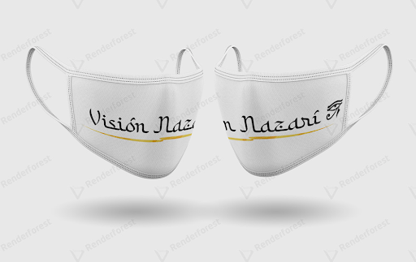
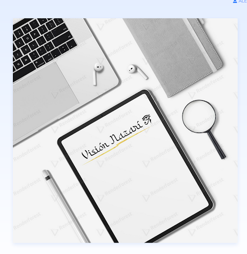

En cuanto a colores, la paleta a emplear en la aplicación así como en el resto de elementos relacionados con la marca Visión Nazarí es esta

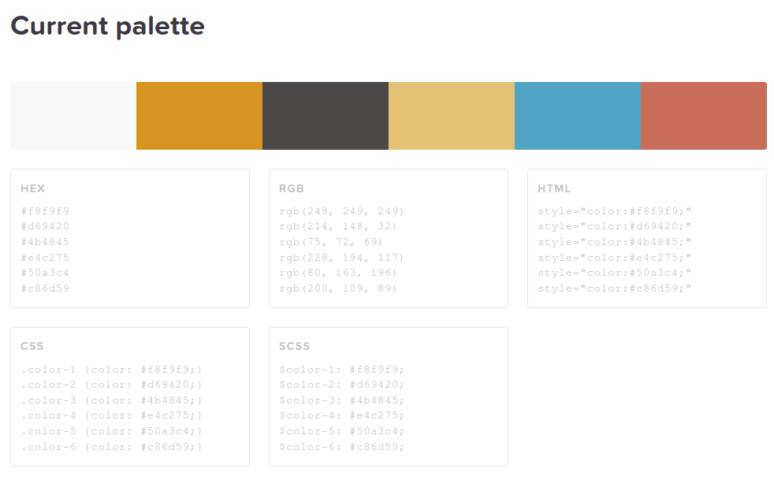

Hemos seleccionado estos colores por diferentes motivos. En primer lugar, los colores con tonalidades rojizas como son el segundo, cuarto y último en la imagen tienen el objetivo de evocar pensamientos relacionados con la arena, los desiertos y las construcciones árabes que en muchas ocasiones empleaban estas tonalidades. Con el color azul se quiere recoradar el agua, elemento extremadamente relevante y central tanto en la cultura como en la arquitectura arábica y nazarí. También tenemos el negro, que es el color asociado con la guerra en la cultura árabe, para no olvidar también el fuerte componente bélico que acompaña al reino nazarí. Por último tenemos el blanco que sería el color del estandarte de Qusay, antepasado de Mahoma, y se considera el color de los Omeyas de Damasco y de los almohades.

Con respecto a las fuentes, hemos seleccionado principalmente 2.
Por un lado tenemos la Khodijah. Esta es la tipografía empleada en el logotipo de la aplicación. La hemos empleado ya que tiene un aspecto que recuerda inmediatamente a la cultura árabe. Sin embargo, es una tipografía demasiado elaborada como para emplearla consistentemente en toda la aplicación sin pecar en legibilidad y accesibilidad. Por esta razón, para el cuerpo de la aplicación hemos decidido emplear una fuente más tradicional como es la Montserrat que es mucho más legible y, además, al estar incluida en Google Fonts es extremadamente portable.

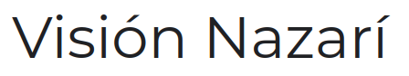 Montserrat

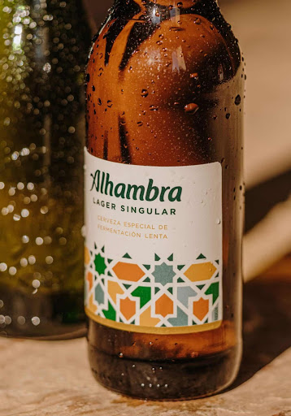
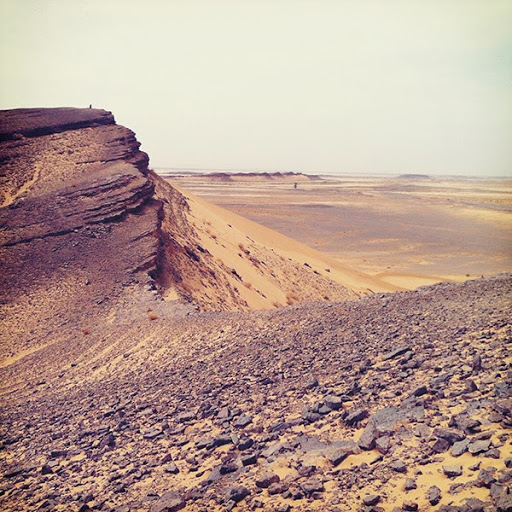
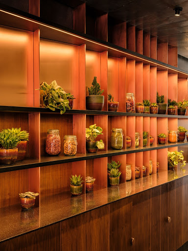

En cuanto a las imágenes inspiradoras hemos seleccionado imágenes en las que los colores y formas son muy evocadoras, nos inspiran y expresan ciertos sentimientos que experimentamos al utilizar la aplicación. 

Utiizamos una cerveza alhambra , ya que es algo muy caracteristico de la ciudad, y que muestra en la que sus curvas y colores la celosía granadina en la que se inspira el diseño de la aplicación. Por otro lado tenemos el desierto y las plantas, pero con unas formas en las imágenes que nos hacen recordar a los 

  3.b Landing Page

En primer lugar en la landing page hemos puesto una frase motivadora, en la que seguidamente se puede ver un CTA para incentivar al usuario a que clicque en el y se pueda descargar nuestra app. Después hemos puesto un subtitulo, para motivar más aún al usuario.

Acto seguido hemos seguido una estructura en 2 columnas en las que varía entre foto y parrafo con CTA. En ellos se pretende mostrar todas las ventajas y virtudes que tiene nuestra aplicación para convencer al usuario a que se la descargue y finalmente unos iconos para destacar grandes funcionalidades/virtudes que tiene la app.

Como se puede apreciar la landing sigue un estilo acorde a la aplicación, utilizando los colores corporativos y fotos relacionadas con la estetica nazarí.

Hemos puesto un menú en lo alto de la página, ya que es una estructura web con la que la mayoría de usuarios esta familiarizado y un footer con la información de contacto y redes sociales.

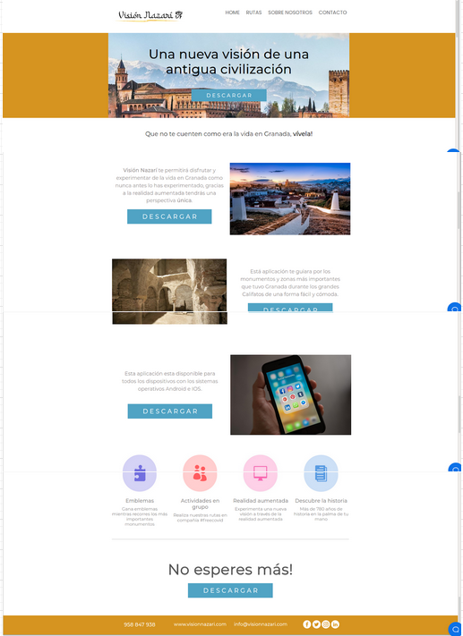

 3.c Guidelines
----

Tras una revisión de los patrones a nuestra disposición hemos decidido emplear los siguientes patrones en nuestra aplicación

1- *Pull to Refresh* --> En las pantallas de los lugares emblemáticos sugeridos al usuario, usaremos este patrón para que estos puedan recargar la página conforme se mueven por la ciudad, de forma que la sugerencias vuelvan a cambiarse
2- *Gallery* --> En las pantallas de lugares emblemáticos, se muestran imágenes de los mismos. Usaremos este patrón para permitir que el usuario pueda ir cambiando el lugar que observa, de forma que se haga bastante hincapié en la imágen que se muestra del sitio, para así captar su atención  
3- *Paginación* --> En la página de insignias, usaremos este patrón para mostrar las diferentes hojas con insignias que se hayan desbloqueado con el uso de la app  
4- *FAQ* --> Usaremos este patrón para agrupas las preguntas más frecuentes de los usuarios en el apartado de configuración y ayuda, de forma que estén bien categorizadas y sean facilmente accesibles desde la propia App  
5- *Vertical Dropdown* --> En la elección de los idiomas para la aplicación, usaremos este patrón para desplegar un menú con los diferentes idiomas a elegir  

  3.d Mockup
----
Con respecto a la práctica anterior, hemos decidido rediseñar algunos de los iconos empleados anteriormente en el prototipado. A continuación se muestra una tabla que recoge cúales son los iconos cambiados, y su rediseño  

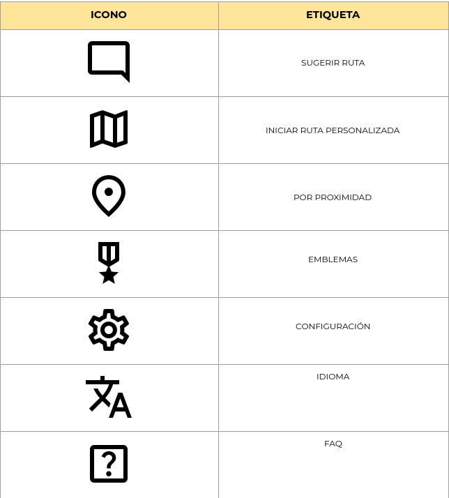

Para esta tarea hemos utilizado JustInMind, es una herramienta que permite realizar un Mockup movil en el que se pueden enlazar las diferentes pantallas y botones. En el video a continuación se muestra la simulación del prototipo realizado mostrando una supuesta interacción de un usuario con la aplicación

 3.e ¿My UX-Case Study?
-----

>>> Publicar my Case Study en Github..
>>> Documente y resuma el diseño de su producto en forma de video de 90 segundos aprox

## Paso 4. Evaluación 

 4.a Caso asignado
----

>>> Breve descripción del caso asignado con enlace a  su repositorio Github

 4.b User Testing
----

>>> Seleccione 4 personas ficticias. Exprese las ideas de posibles situaciones conflictivas de esa persona en las propuestas evaluadas. Asigne dos a Caso A y 2 al caso B
 

| Usuarios | Sexo/Edad     | Ocupación   |  Exp.TIC    | Personalidad | Plataforma | TestA/B
| ------------- | -------- | ----------- | ----------- | -----------  | ---------- | ----
| User1's name  | H / 18   | Estudiante  | Media       | Introvertido | Web.       | A 
| User2's name  | H / 18   | Estudiante  | Media       | Timido       | Web        | A 
| User3's name  | M / 35   | Abogado     | Baja        | Emocional    | móvil      | B 
| User4's name  | H / 18   | Estudiante  | Media       | Racional     | Web        | B 

. 4.c Cuestionario SUS
----

>>> Usaremos el **Cuestionario SUS** para valorar la satisfacción de cada usuario con el diseño (A/B) realizado. Para ello usamos la [hoja de cálculo](https://github.com/mgea/DIU19/blob/master/Cuestionario%20SUS%20DIU.xlsx) para calcular resultados sigiendo las pautas para usar la escala SUS e interpretar los resultados
http://usabilitygeek.com/how-to-use-the-system-usability-scale-sus-to-evaluate-the-usability-of-your-website/)
Para más información, consultar aquí sobre la [metodología SUS](https://cui.unige.ch/isi/icle-wiki/_media/ipm:test-suschapt.pdf)

>>> Adjuntar captura de imagen con los resultados + Valoración personal 

 4.d Usability Report
----

>> Añadir report de usabilidad para práctica B (la de los compañeros)

>>> Valoración personal 

## Paso 5. Evaluación de Accesibilidad  

  5.a Accesibility evaluation Report 
----

>>> Indica qué pretendes evaluar (de accesibilidad) sobre qué APP y qué resultados has obtenido 

>>> 5.a) Evaluación de la Accesibilidad (con simuladores o verificación de WACG) 
>>> 5.b) Uso de simuladores de accesibilidad 

>>> (uso de tabla de datos, indicar herramientas usadas) 

>>> 5.c Breve resumen del estudio de accesibilidad (de práctica 1) y puntos fuertes y de mejora de los criterios de accesibilidad de tu diseño propuesto en Práctica 4.

## Conclusión final / Valoración de las prácticas

>>> (90-150 palabras) Opinión del proceso de desarrollo de diseño siguiendo metodología UX y valoración (positiva /negativa) de los resultados obtenidos  

